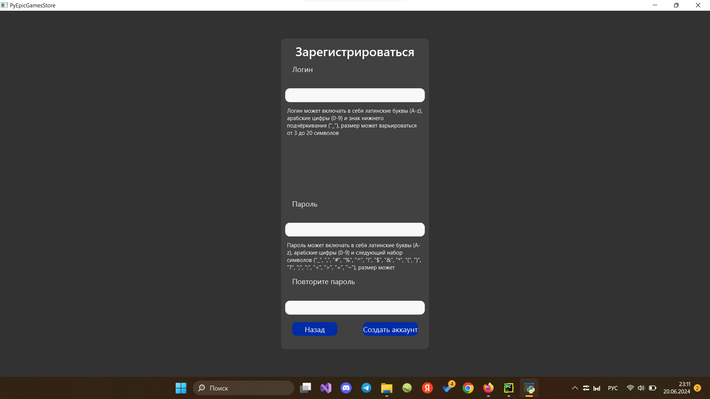
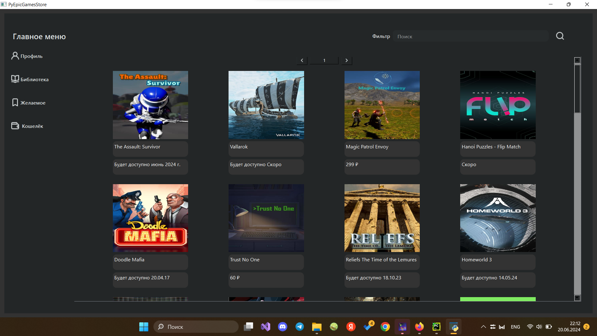
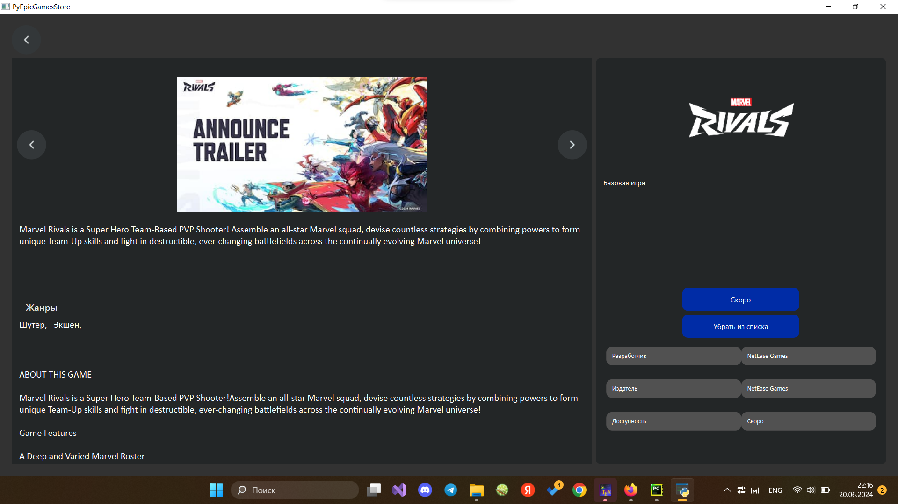
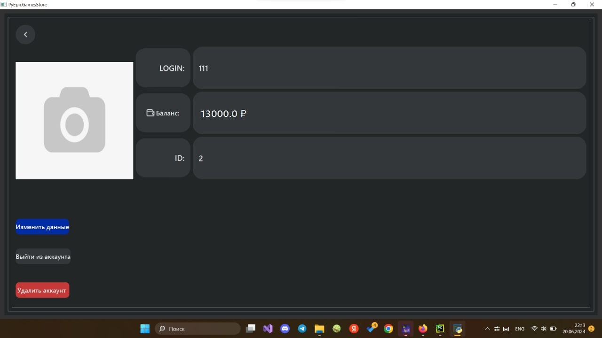
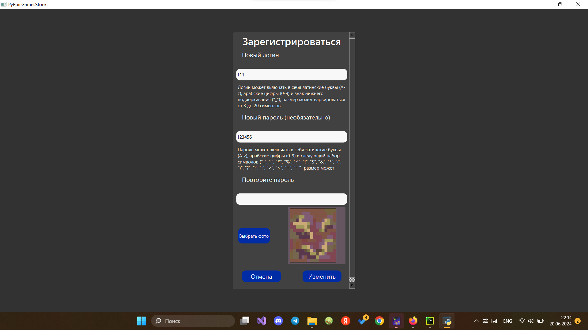
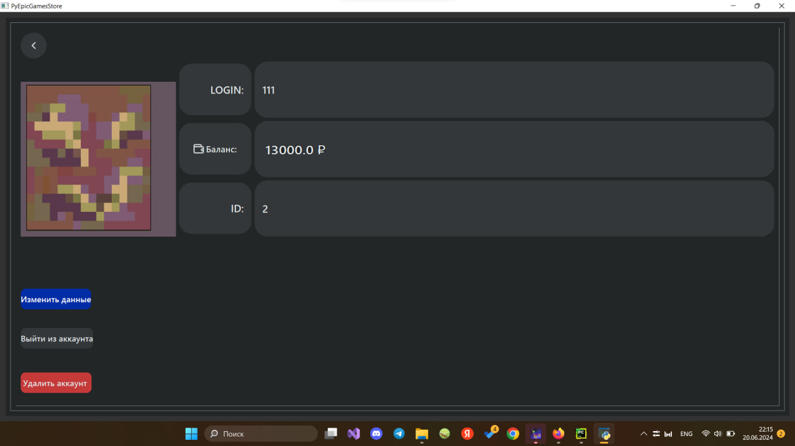
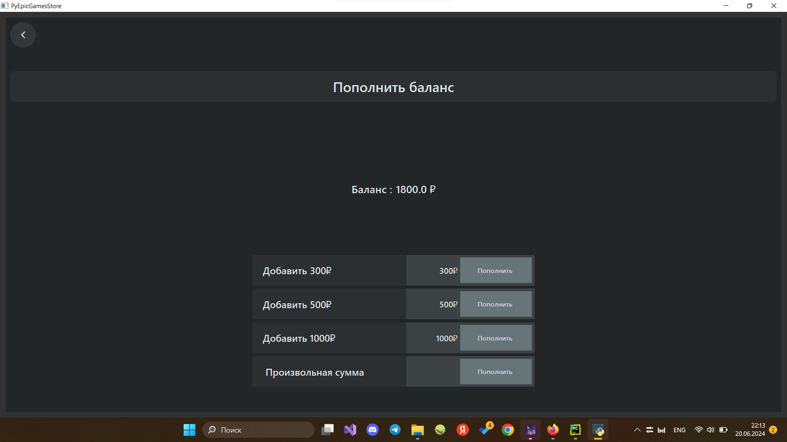

# My EpicGamesStore
## Введение
Многим известен магазин видеогр **EpicGamesStore**, в котором содержится широкая библиотека товаров. Данный проект был вдохнавлён им.

Данный проект в своём функцианале сильно отличается от **EpicGamesStore**, однако старались перенести дизайн, схожий по стилю. В базе данных игр хранится 1212 игр, данные о которых были взяты из сайта **EpicGamesStore** за счёт парсера.

Окно приложения и его элементы полностью адаптивные, то есть элементы приложения занимают определённое местоположение и изменяются до определённого размера в зависимости от размера всего окна.

## Регистрация

В приложении присутствует система регистрации и аккаунтов.

Первое окно, которое встречает пользователя после открытия проекта – окно для входа в аккаунт.

В случае необходимости создать новый аккаунт пользователь может перейти в окно регистрации.

## Главное меню

После завершения процедуры входа пользователь попадает в главное меню.

В ней представлены следующие элементы:
+ Боковая панель
  + Кнопка перехода в профиль
  + Кнопка просмотра приобретённых игр
  + Кнопка просмотра списка желаемого
  + Кнопка перехода в окно пополнения кошелька
+ Основное окно
  + Кнопки для перелистывания страниц
  + Кнопка для быстрого перехода на определённую страницу, введённую пользоваетелем в появляющемся далоговом окне
  + Список из карточек игр
    + Обложка игры, являющейся одновременно кнопкой перехода на страницу игры
    + Строка названия игры
    + Строка с информацией о цене или датой выхода

## Страница игры

При нажатии на обложку видеоигры совершается переход на страницу с информацией о ней.

На этой страние представлена следующая информация продукте:
+ Скриншоты игры
+ Аннотация
+ Жанры
+ Подробное описание игры
+ Основная иконка игры
+ Дополнительная информация о характере игры (если указано)
+ Дополнительная информация об издании
+ Информация о статусе игры относительно даты выхода или цены или о статусе совершения покупки
+ Информация о статусе включении в список желаемого пользователем

На этой странице предоставлены следующие возможности взаимодействия:
+ Возможность просматривать скриншоты игры
+ Возможность купить игры при условии, что у пользователя достаточный баланс и релиз самого продкута уже совершился
+ Возможность добавить в список желаемого

## Профиль

При нажатии на кнопку *Профиль* в боковой панели на гравном меню открывается окно с информацией о пользователе:
+ Логин
+ ID
+ Баланс
+ Аватар, при наличии

Также имеются несколько кнопок для взаимодействия с профилем:
+ Выход из аккаунта (при нажатии совершается переход на онкно входа в аккаунт)
+ Удаление аккаунта (при нажатии совершается переход на онкно входа в аккаунт)
+ Изменение данных пользователя

В последнем случае совершается переход в специальное окно для изменения текущих данных пользователя.

В данном окне пользователь может изменить свой логин, пароль, а также установить себе аватарку профиля.

## Кошелёк

При нажатии на кнопку *Кошелёк* в боковой панели на гравном меню открывается окно пополнения баланса пользователя.

В данном окне предоставлены следующие возможности:
+ Пополнить баланс на 300 рублей
+ Пополнить баланс на 500 рублей
+ Пополнить баланс на 1000 рублей
+ Выбрать сумму для пополнения баланса

При нажатии на кнопку *Пополнить баланс* в верхней части окна совершается пополнение баланса пользователя, при необходимости отменить действие достаточно просто выйти из окна.
